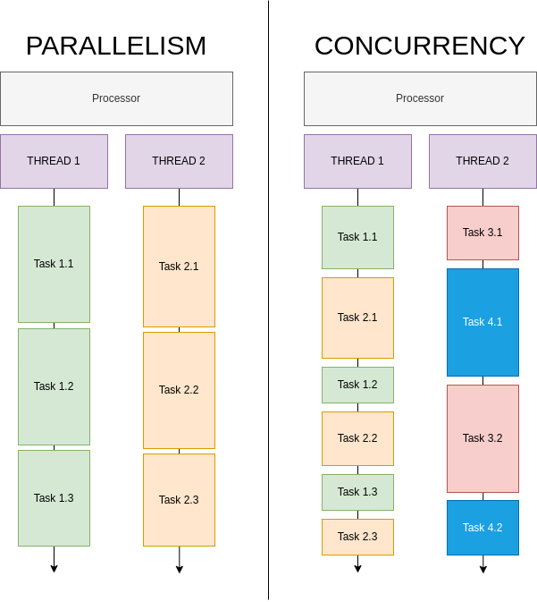

# What is Concurrency ?

- CONCURRENT: Happening or existing at the same time
    - Source: Cambridge Dictionary, 2023

---

# What is Parallelism ?

- PARALLEL: To happen at the same time as something else, or be similar or equal to something else.
    - Source: Cambridge Dictionary, 2023


---

# PARALLELISM vs CONCURRENCY



---

# Why choose Concurrency ?

- Improved CPU utilization when waiting for I/O.
- Gives the illusion of parallel processing (on a fast processor). 
- Better response times.
- Allows programs to be divided/organized into independent tasks.
- Cheaper to switch task vs designing faster/multicore cpu.

---

# Threads in Rust

- 1 LANGUAGE THREAD = 1 OS THREAD 

---

# From 1 to 5

```rust
fn task1() {
    for i in 1..=5 {
        println!("Task1.{}", i);
    }
}
```

---

# Creating Threads

```rust
use std::thread;
//fn task1 ...
fn main() {
	let t1 = thread::spawn(task1);
	t1.join();
}
```

---

# Creating 2 Threads

```rust
//fn task1 …
//fn task2 …
fn main() {
	let t1 = thread::spawn(task1);
	let t2 = thread::spawn(task2);
	t1.join();
	t2.join();
}
```

---

# Async Programming

- Spawning and switching between threads is quite expensive as even idle threads consume system resources.
- An async runtime uses a small amount of (expensive) threads to handle a large amount of (cheap) tasks.

---

# Async Terms

- **Future** trait: A future is a value that might not have finished computing yet. This trait is provided by the std library.
- **async** keyword: Return a Future instead of blocking the current thread. Supported by Rust compiler. Usually written before a function.
- **await** keyword: Suspend execution until the result of a Future is ready. Supported by Rust compiler. Usually written after a function.
- **Executor**: Futures run on an executors. These are implemented by an Async runtime.


---

# Using tokio

- To add tokio, update your Cargo.toml and add the following:

	```rust
	[dependencies]
	tokio = { version = "1.36.0", features = ["full"] }
	```
---

# async programming in rust using tokio 

```rust
use tokio::time::{sleep, Duration};
pub async fn task(num: u32) {
	for i in 1..=5 {
    	println!("Task{}.{}      	|", num, i);
    	sleep(Duration::from_secs(5)).await;
	}
}

#[tokio::main]
async fn main() {
	let jh1 = tokio::task::spawn(task(1));
	let jh2 = tokio::task::spawn(task(2));
	let _ = tokio::join!(jh1, jh2);
	// or use jh1.await; jh2.await;
}
```

---

# What if we want to stop on error ?

```rust
#[tokio::main]
async fn main() {
	let jh1 = tokio::task::spawn(task1());
	let jh2 = tokio::task::spawn(task2());
	let err = tokio::try_join!(jh1, jh2).unwrap_err();
	println!("Error: {}", err);
}
```

---

# Can Tasks communicate with each other ?

- YES !
- Option 1 : Shared Data Structures/Memory
- Option 2 : Message Passing

---

# Message Passing

```rust
let (tx, rx) = tokio::mpsc::channel::<Food>(5);

let food = Food { name: format!("Sandwich") };

tx.send(food.clone()).await;

let Some(food) = rx.recv().await;

```

---

# Rust async Vs Other Languages

- Futures are inert in Rust and make progress only when polled.
- Async is zero-cost in Rust, which means that you only pay for what you use. Specifically, you can use async without heap allocations and dynamic dispatch, which is great for performance! This also lets you use async in constrained environments, such as embedded systems.
- No built-in runtime is provided by Rust. Instead, runtimes are provided by community maintained crates. Ex: Tokio, Embassy etc.
- Both single- and multithreaded runtimes/executors are available in Rust, which have different strengths and weaknesses.

---

# Producer + Consumer demo