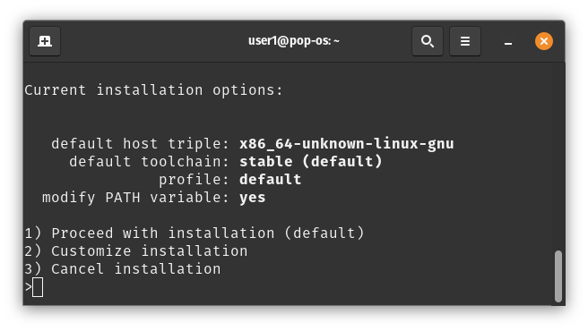
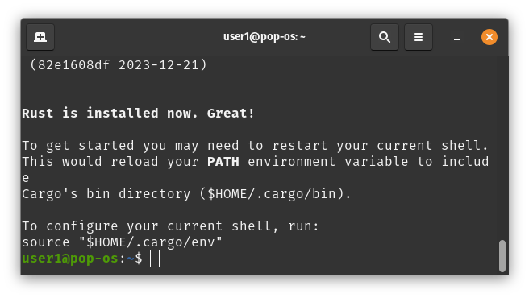

# Installing Rust on Windows

- Follow Instructions here : https://www.rust-lang.org/tools/install
- Install using `rustup` standalone installer
- For a modern windows laptop you probably need the msi file for `x86_64-pc-windows-gnu` from [Other Installation Methods](https://forge.rust-lang.org/infra/other-installation-methods.html#standalone-installers) page.

---

# Installing Rust on Linux

- Follow Instructions here : https://www.rust-lang.org/tools/install
- Run a terminal
- Execute `curl --proto '=https' --tlsv1.2 -sSf https://sh.rustup.rs | sh`
- Select `1) Proceed With Installation`
    

---

- On success, you will see the following :
    
- You can also check the installed version as follows:
    ```
    $ rustc --version
    rustc 1.75.0 (82e1608df 2023-12-21)
    ```

---

# Installing rust on MacOS

- Follow Instructions here : https://www.rust-lang.org/tools/install
- Install Brew : https://brew.sh/
- Install rustup : https://formulae.brew.sh/formula/rustup-init#default
    ```
    brew install rustup-init
    ```

---

# Install an IDE

It is Recommended to use Visual Studio Code IDE for development.

- To install VS Code follow instructions here : https://code.visualstudio.com/docs/setup/setup-overview

- Install `rust-analyzer` extension for VS Code for code completion and other useful features

- Install `CodeLLDB` extension to enable debugging support in VS Code for Rust